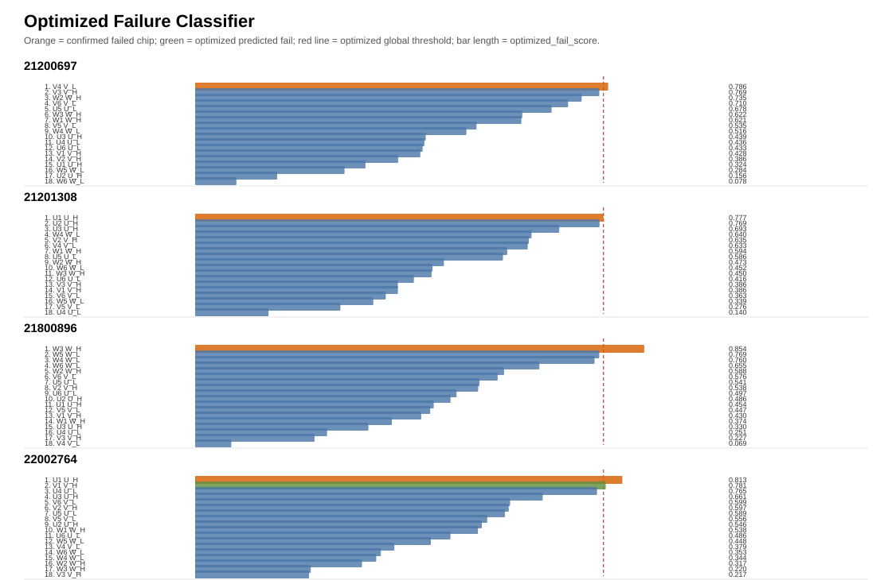

# 优化版芯片失效二分类模型说明

## 1. 输入数据

模型输入来自两级结果：

- 原始 Excel 数据：
  - `芯片层级制程数据【加颜色标注】.xlsx`：提供芯片级测试指标和橙色失效标注。
  - `模块层级制程数据【加颜色标注】.xlsx`：提供模块/桥臂级制程参数，用于上游桥臂异常评分。
- 上游特征文件：
  - `result/bridge_chip_risk_model/risk_scores.csv`

当前有效样本：

| 项目                   | 数值 |
| ---------------------- | ---: |
| 芯片样本数             |   72 |
| 模块数                 |    4 |
| 每模块芯片数           |   18 |
| 确认失效芯片数         |    4 |
| 当前按非失效评估芯片数 |   68 |

标签定义：

- `label_bad = 1`：芯片层级 Excel 中橙色标注的确认失效芯片。
- `label_bad = 0`：未标橙色芯片，当前按非失效样本评估。

## 2. 输入特征

### 2.1 基线模型特征

基线模型使用 4 个模块内百分位信号：

| 特征                       | 来源                                  | 方向含义                     |
| -------------------------- | ------------------------------------- | ---------------------------- |
| `global_consistency_pct` | `chip_raw_outlier_score` 反向百分位 | 原始跨模块离群越低，风险越高 |
| `IGE4_30_high_pct`       | `IGE4_30` 模块内百分位              | 数值越高，风险越高           |
| `IGE5_R30_high_pct`      | `IGE5_R30` 模块内百分位             | 数值越高，风险越高           |
| `ICES7_1330_high_pct`    | `ICES7_1330` 模块内百分位           | 数值越高，风险越高           |

### 2.2 优化版模型特征

优化版模型在当前数据内以“已知失效召回不下降、误报尽量减少”为目标，筛选出 4 个稀疏加权信号：

| 符号  | 输出字段                                  | 来源字段                   | 百分位范围 | 权重 | 方向含义                             |
| ----- | ----------------------------------------- | -------------------------- | ---------- | ---: | ------------------------------------ |
| `a` | `chip_raw_abs_z_max_low_module_pct`     | `chip_raw_abs_z_max`     | 模块内     |    3 | 原始最大离群越低，风险越高           |
| `b` | `chip_raw_outlier_score_low_module_pct` | `chip_raw_outlier_score` | 模块内     |    1 | 原始离群分越低，风险越高             |
| `c` | `VTH5_10m_dbc_abs_z_low_module_pct`     | `VTH5_10m_dbc_abs_z`     | 模块内     |    3 | VTH5_10m 在 DBC 内偏离越低，风险越高 |
| `d` | `IGE5_R30_module_abs_z_low_global_pct`  | `IGE5_R30_module_abs_z`  | 全局       |    2 | IGE5_R30 模块内偏离越低，风险越高    |

## 3. 模型方法

### 3.1 基线分数

```text
fail_score = mean(global_consistency_pct,
                  IGE4_30_high_pct,
                  IGE5_R30_high_pct,
                  ICES7_1330_high_pct)
```

基线判定规则：

```text
global_threshold = min(fail_score for label_bad = 1)
predicted_fail = 1 if fail_score >= global_threshold else 0
```

当前基线阈值：

```text
global_threshold = 0.6324
```

### 3.2 优化版分数

```text
optimized_fail_score = (3*a + 1*b + 3*c + 2*d) / 9
```

优化版判定规则：

```text
optimized_global_threshold = min(optimized_fail_score for label_bad = 1)
optimized_predicted_fail = 1 if optimized_fail_score >= optimized_global_threshold else 0
```

当前优化版阈值：

```text
optimized_global_threshold = 0.7768
```

说明：

- 两套模型都使用全局阈值，不假设每个模块一定存在失效芯片。
- 模块内排名只作为解释字段，不参与最终二分类判定。
- 优化版是当前数据内筛选得到的稀疏规则，不能视为跨批次验证后的生产级模型。

## 4. 输出文件和字段

输出文件：

- `result/failure_prediction/failure_predictions.csv`
- `result/failure_prediction/result.md`
- `result/failure_prediction/prediction_by_module.svg`

核心输出字段：

| 字段                           | 含义                 |
| ------------------------------ | -------------------- |
| `SN_ID`                      | 模块编号             |
| `DBC_LOCATION`               | DBC 位置             |
| `芯片位置`                   | 芯片位置             |
| `bridge_group`               | 桥臂组               |
| `label_bad`                  | 确认失效标签         |
| `fail_score`                 | 基线失效分数         |
| `global_threshold`           | 基线全局阈值         |
| `predicted_fail`             | 基线二分类结果       |
| `optimized_fail_score`       | 优化版失效分数       |
| `optimized_global_threshold` | 优化版全局阈值       |
| `optimized_predicted_fail`   | 优化版二分类结果     |
| `rank_in_module`             | 基线分数模块内排名   |
| `optimized_rank_in_module`   | 优化版分数模块内排名 |

## 5. 效果对比

### 5.1 指标对比表

| 指标              | 基线模型 | 优化版 |
| ----------------- | -------: | -----: |
| TP                |        4 |      4 |
| FP                |       12 |      1 |
| TN                |       56 |     67 |
| FN                |        0 |      0 |
| 判失效芯片数      |       16 |      5 |
| 阈值              |   0.6324 | 0.7768 |
| Recall            |    1.000 |  1.000 |
| Precision         |    0.250 |  0.800 |
| Accuracy          |    0.833 |  0.986 |
| Average precision |    0.446 |  0.950 |

### 5.2 混淆矩阵

基线模型：

| 实际\\ 预测 | 判未失效 | 判失效 |
| ----------- | -------: | -----: |
| 未失效      |       56 |     12 |
| 失效        |        0 |      4 |

优化版：

| 实际\\ 预测 | 判未失效 | 判失效 |
| ----------- | -------: | -----: |
| 未失效      |       67 |      1 |
| 失效        |        0 |      4 |

### 5.3 指标柱状对比

| 指标              | 基线模型                       | 优化版                         |
| ----------------- | ------------------------------ | ------------------------------ |
| Precision         | `#####---------------` 0.250 | `################----` 0.800 |
| Recall            | `####################` 1.000 | `####################` 1.000 |
| Accuracy          | `#################---` 0.833 | `####################` 0.986 |
| Average precision | `#########-----------` 0.446 | `###################-` 0.950 |

### 5.4 优化版判失效清单

带 `*` 的芯片为当前确认失效芯片。

| SN_ID                               | 判失效芯片      | 说明                                            |
| ----------------------------------- | --------------- | ----------------------------------------------- |
| `E3003161ABV40298001001K21200697` | `V4*`         | 确认失效                                        |
| `E3003161ABV40298001001K21201308` | `U1*`         | 确认失效                                        |
| `E3003161ABV40298001001K21800896` | `W3*`         | 确认失效                                        |
| `E3003161ABV40298001001K22002764` | `U1*`, `V1` | `U1` 为确认失效，`V1` 为当前误报/待复核芯片 |

## 6. 结果图

下图展示每个模块内的优化版 `optimized_fail_score` 排序。橙色表示确认失效芯片，绿色表示优化版判定为失效，红色虚线为优化版全局阈值。



## 7. 泛化风险

当前优化版效果明显优于基线，但必须注意：

- 当前只有 4 个确认失效样本，正例数量很少。
- 优化特征是在当前数据内筛选得到，存在小样本过拟合风险。
- leave-one-module 检查显示，留出模块 `E3003161ABV40298001001K21201308` 时会出现 1 个 FN，说明优化阈值跨模块泛化仍不稳定。

Leave-one-module 检查：

| 留出模块                            | 训练阈值 | TP | FP | FN |
| ----------------------------------- | -------: | -: | -: | -: |
| `E3003161ABV40298001001K21200697` |   0.7768 |  1 |  0 |  0 |
| `E3003161ABV40298001001K21201308` |   0.7857 |  0 |  0 |  1 |
| `E3003161ABV40298001001K21800896` |   0.7768 |  1 |  0 |  0 |
| `E3003161ABV40298001001K22002764` |   0.7768 |  1 |  1 |  0 |

推荐汇报口径：

> 当前模型可表述为“现有数据内增强版失效预警二分类模型”。它在当前数据上保持已知失效全覆盖，并显著降低误报，但尚不能表述为已经完成跨批次验证的生产级精准判废模型。
